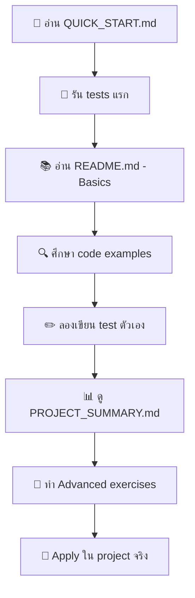

# 📖 Documentation Index - คู่มือการใช้งาน

ยินดีต้อนรับสู่ **Demo Unit Tests Project** - โปรเจคสาธิตการเขียน Unit Tests ใน Flutter อย่างครบถ้วน

## 🗂️ เอกสารทั้งหมด

### 🚀 เริ่มต้นใช้งาน

- **[QUICK_START.md](QUICK_START.md)** - เริ่มต้น unit testing ใน 10 นาที ⚡
- **[README.md](README.md)** - คู่มือใช้งานหลักฉบับสมบูรณ์ 📚
- **[PROJECT_SUMMARY.md](PROJECT_SUMMARY.md)** - สรุปโปรเจคและผลลัพธ์ testing 📊

### 📋 อ้างอิง

- **[TESTING_CHEAT_SHEET.md](TESTING_CHEAT_SHEET.md)** - สรุป syntax และ patterns สำหรับอ้างอิง 📝

## 🎯 เลือกเอกสารตามระดับความรู้

### 🔰 **ผู้เริ่มต้น (Beginner)**

1. อ่าน **[QUICK_START.md](QUICK_START.md)** ก่อน - ใช้เวลา 10 นาที
2. ทำตาม steps ใน Quick Start
3. อ่าน **"เริ่มต้นสำหรับผู้เริ่มต้น"** ใน [README.md](README.md)

### 🟡 **ระดับกลาง (Intermediate)**

1. อ่าน **[README.md](README.md)** ส่วน "Advanced Concepts"
2. ศึกษา E2E guide ใน [PROJECT_SUMMARY.md](PROJECT_SUMMARY.md)
3. ใช้ [TESTING_CHEAT_SHEET.md](TESTING_CHEAT_SHEET.md) เป็น reference

### 🟠 **ระดับสูง (Advanced)**

1. อ่าน **[PROJECT_SUMMARY.md](PROJECT_SUMMARY.md)** เพื่อดูภาพรวม
2. ศึกษา advanced patterns ใน code
3. ดู Integration testing และ performance considerations

### 🔴 **ผู้เชี่ยวชาญ (Expert)**

1. วิเคราะห์ architecture และ patterns ใน code
2. ศึกษา custom matchers และ advanced mocking
3. พิจารณา CI/CD integration

## 🚦 เส้นทางการเรียนรู้แนะนำ



## 📂 โครงสร้างโปรเจค

```
demo_unit_tests/
├── 📖 Documentation/
│   ├── README.md              # คู่มือหลัก
│   ├── QUICK_START.md         # เริ่มต้น 10 นาที
│   ├── PROJECT_SUMMARY.md     # สรุปโปรเจค
│   ├── TESTING_CHEAT_SHEET.md # Reference sheet
│   └── DOCUMENTATION_INDEX.md # ไฟล์นี้
│
├── 💻 Source Code/
│   ├── lib/                   # Application code
│   │   ├── models/           # Data models
│   │   ├── services/         # Business logic
│   │   ├── utils/            # Utility functions
│   │   └── widgets/          # Custom widgets
│   │
├── 🧪 Test Code/
│   ├── test/                 # Unit & Widget tests
│   │   ├── models/          # Model tests
│   │   ├── services/        # Service tests
│   │   ├── utils/           # Utility tests
│   │   └── widgets/         # Widget tests
│   │
│   └── integration_test/     # Integration tests
│
└── 🔧 Config Files/
    ├── pubspec.yaml         # Dependencies
    ├── analysis_options.yaml # Code analysis
    └── build.yaml           # Build configuration
```

## 🎓 เป้าหมายการเรียนรู้

หลังจากศึกษาเอกสารทั้งหมด คุณจะสามารถ:

### ✅ **พื้นฐาน (Fundamentals)**

- เข้าใจ unit testing concepts
- เขียน basic tests ได้
- ใช้ Arrange-Act-Assert pattern
- รัน และ debug tests

### ✅ **ขั้นกลาง (Intermediate)**

- เขียน widget tests
- ใช้ mocking อย่างถูกต้อง
- จัดการ async testing
- เขียน integration tests

### ✅ **ขั้นสูง (Advanced)**

- ออกแบบ test architecture
- สร้าง custom matchers
- จัดการ complex scenarios
- เพิ่ม tests ใน CI/CD

## 📞 ความช่วยเหลือ

### 🐛 มีปัญหา?

1. ดู **"Troubleshooting"** ใน [README.md](README.md)
2. ดู **"Common Issues"** ใน [TESTING_CHEAT_SHEET.md](TESTING_CHEAT_SHEET.md)
3. ตรวจสอบ error messages อย่างละเอียด

### ❓ มีคำถาม?

1. ดู **"FAQ"** ใน [README.md](README.md)
2. ค้นหาใน [TESTING_CHEAT_SHEET.md](TESTING_CHEAT_SHEET.md)
3. อ่าน relevant sections ในเอกสาร

### 💡 ต้องการตัวอย่างเพิ่ม?

1. ศึกษา **test files** ใน `test/` directory
2. ดู **E2E guide** ใน [PROJECT_SUMMARY.md](PROJECT_SUMMARY.md)
3. ทดลองกับ examples ใน code

## 🏆 เมื่อเสร็จสิ้นการศึกษา

เมื่อคุณเรียนจบแล้ว คุณจะมี:

- ✅ ความเข้าใจ Flutter testing อย่างถ่องแท้
- ✅ ทักษะเขียน tests ที่มีคุณภาพ
- ✅ ความมั่นใจในการ apply ใน project จริง
- ✅ ความรู้ในการ maintain และ scale tests

## 🚀 ขั้นตอนถัดไป

1. **Practice** - ทดลองใน project ตัวเอง
2. **Share** - แบ่งปันความรู้กับทีม
3. **Contribute** - เสนอ improvement ให้โปรเจค
4. **Teach** - สอนคนอื่นเพื่อเสริมสร้างความรู้

---

**🎯 เป้าหมาย:** สร้างนักพัฒนาที่เขียน tests อย่างมั่นใจ

**⏰ เวลาประมาณ:**

- Quick Start: 10 นาที
- พื้นฐาน: 1-2 ชั่วโมง
- ครบถ้วน: 4-6 ชั่วโมง

**📈 ROI:** Testing skills ที่ใช้ได้ตลอดอาชีพ

**Happy Testing! 🧪✨**
